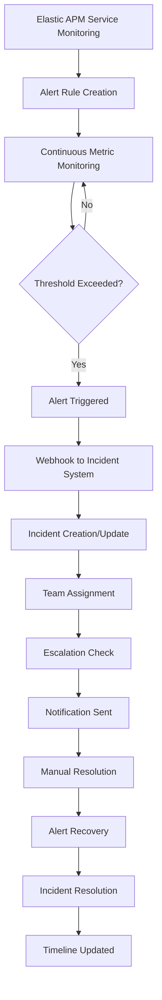

# Alert and Incident Lifecycle - Elastic APM Integration

## 🔄 **Complete Lifecycle Overview**

The integration between Elastic APM and the incident management system creates a seamless alert-to-incident workflow that automatically handles monitoring, alerting, incident creation, escalation, and resolution.



## 🚀 **Phase 1: Alert Setup and Configuration**

### **1.1 Service Discovery**
```bash
# The script discovers all services in Elastic APM
GET /api/apm/services
```

**Response:**
```json
[
  {"serviceName": "api-gateway", "environment": "production"},
  {"serviceName": "user-service", "environment": "production"},
  {"serviceName": "payment-service", "environment": "production"}
]
```

### **1.2 Team Mapping**
The system maps services to teams using `config/team_mapping.json`:

```json
{
  "api-gateway": {
    "team_name": "Platform Team",
    "description": "Platform infrastructure team"
  },
  "user-service": {
    "team_name": "User Management Team", 
    "description": "User management team"
  }
}
```

### **1.3 Alert Rule Creation**
For each service and metric, the system creates alert rules in Elastic APM:

```json
{
  "name": "High Latency Alert - api-gateway",
  "params": {
    "metric": "transaction.duration.us",
    "aggregationType": "p95",
    "threshold": 1000.0,
    "windowSize": "5m",
    "serviceName": "api-gateway",
    "environment": "production"
  },
  "actions": [
    {
      "group": "threshold_met",
      "id": "webhook",
      "params": {
        "body": "{\"alert_name\":\"High Latency Alert - api-gateway\",\"severity\":\"high\",\"service\":{\"name\":\"api-gateway\"},\"metadata\":{\"team_id\":1}}"
      }
    }
  ],
  "tags": ["service:api-gateway", "metric:latency", "severity:high"]
}
```

## 🔥 **Phase 2: Alert Triggering**

### **2.1 Metric Threshold Exceeded**
When a service metric exceeds the configured threshold:

- **Latency**: Response time > 1000ms (p95)
- **Error Rate**: Failure rate > 5%
- **CPU Usage**: CPU utilization > 85%
- **Memory Usage**: Memory usage > 90%

### **2.2 Webhook Payload Generation**
Elastic APM automatically generates a webhook payload:

```json
{
  "alert_name": "High Latency Alert - api-gateway",
  "message": "Service response time is high",
  "severity": "high",
  "service": {
    "name": "api-gateway",
    "environment": "production",
    "version": "1.0.0"
  },
  "alert_id": "latency-alert-123",
  "state": {
    "state": "active",
    "timestamp": "2024-01-20T10:30:00Z"
  },
  "metadata": {
    "metric_type": "latency",
    "threshold": 1000.0,
    "current_value": 1500.0,
    "team_id": 1
  },
  "tags": {
    "environment": "production",
    "team_id": "1",
    "service": "api-gateway"
  }
}
```

### **2.3 Webhook Delivery**
Elastic APM sends a POST request to the incident management system:

```bash
POST /v1/alerts/elastic
Content-Type: application/json
Authorization: Bearer <webhook_token>

{
  "alert_name": "High Latency Alert - api-gateway",
  "severity": "high",
  "service": {"name": "api-gateway"},
  "alert_id": "latency-alert-123",
  "state": {"state": "active"}
}
```

## 🚨 **Phase 3: Incident Creation and Processing**

### **3.1 Webhook Processing**
The incident management system receives the webhook and processes it:

```python
@router.post("/v1/alerts/elastic")
async def handle_elastic_webhook(webhook_data: ElasticWebhookPayload):
    # Extract incident data from webhook
    incident_data = extract_incident_data(webhook_data)
    
    # Check for existing incident
    existing_incident = crud.incident.get_by_alert_id(db, alert_id=alert_id)
    
    if existing_incident:
        # Update existing incident
        incident = update_existing_incident(existing_incident, incident_data)
    else:
        # Create new incident
        incident = create_new_incident(incident_data)
    
    # Add timeline event
    add_timeline_event(incident.id, "CREATED", {"source": "elastic_apm"})
    
    return ElasticWebhookResponse(status="incident_created", incident_id=incident.id)
```

### **3.2 Incident Data Extraction**
The system extracts and transforms webhook data:

```python
def extract_incident_data(alert_data):
    return {
        "title": alert_data.get("alert_name", "New Alert"),
        "description": alert_data.get("message", "No description"),
        "severity": alert_data.get("severity", "medium"),
        "service": alert_data.get("service", {}).get("name", "unknown"),
        "alert_id": alert_data.get("alert_id"),
        "metadata": {
            "raw_alert": alert_data,
            "team_id": alert_data.get("metadata", {}).get("team_id")
        }
    }
```

### **3.3 Incident Creation**
A new incident is created with the following structure:

```json
{
  "id": 123,
  "title": "High Latency Alert - api-gateway",
  "description": "Service response time is high",
  "severity": "high",
  "service": "api-gateway",
  "status": "triggered",
  "team_id": 1,
  "alert_id": "latency-alert-123",
  "metadata": {
    "raw_alert": {...},
    "team_id": 1,
    "metric_type": "latency",
    "threshold": 1000.0,
    "current_value": 1500.0
  },
  "created_at": "2024-01-20T10:30:00Z",
  "updated_at": "2024-01-20T10:30:00Z"
}
```

## 👥 **Phase 4: Team Assignment and Escalation**

### **4.1 Team Assignment**
The incident is automatically assigned to the appropriate team based on the service:

```python
# Team assignment based on service mapping
team_id = get_team_id_for_service(incident.service)
incident.team_id = team_id
```

### **4.2 Escalation Policy Matching**
The system checks for matching escalation policies:

```python
def get_matching_policies(incident):
    policies = crud.escalation_policy.get_active_policies(db)
    return [p for p in policies if policy_matches_incident(p, incident)]

def policy_matches_incident(policy, incident):
    conditions = policy.conditions or {}
    
    # Check severity match
    if "severity" in conditions:
        if incident.severity not in conditions["severity"]:
            return False
    
    # Check service match
    if "service" in conditions:
        if incident.service not in conditions["service"]:
            return False
    
    # Check team match
    if "team_id" in conditions:
        if incident.team_id not in conditions["team_id"]:
            return False
    
    return True
```

### **4.3 Escalation Target Resolution**
For each escalation step, the system finds appropriate users:

```python
def get_escalation_targets(incident, target):
    if target == "team_lead":
        return get_users_by_role_and_team("team_lead", incident.team_id)
    elif target == "manager":
        return get_users_by_role_and_team("manager", incident.team_id)
    elif target == "assignees":
        return [assignment.user for assignment in incident.assignments]
```

### **4.4 Escalation Event Creation**
Escalation events are created and tracked:

```json
{
  "id": 456,
  "incident_id": 123,
  "policy_id": 789,
  "step_number": 1,
  "target": "team_lead",
  "status": "pending",
  "created_at": "2024-01-20T10:30:00Z",
  "escalated_at": "2024-01-20T10:35:00Z",
  "resolved_at": null
}
```

## 📢 **Phase 5: Notification and Communication**

### **5.1 Notification Generation**
The system sends notifications to escalation targets:

```python
async def send_escalation_notification(escalation_event):
    targets = get_escalation_targets(escalation_event.incident, escalation_event.target)
    
    for user in targets:
        await notification_service.send_notification(
            user_id=user.id,
            notification_type="escalation",
            title=f"Incident Escalated: {escalation_event.incident.title}",
            message=f"Incident {escalation_event.incident.id} has been escalated to you.",
            data={
                "incident_id": escalation_event.incident.id,
                "escalation_id": escalation_event.id,
                "severity": escalation_event.incident.severity
            }
        )
```

### **5.2 Notification Channels**
Notifications are sent through multiple channels:

- **Email**: Direct email to escalation targets
- **Slack**: Team channel notifications
- **SMS**: Critical incident SMS alerts
- **Webhook**: Integration with external systems

### **5.3 Notification Preferences**
Users can configure their notification preferences:

```json
{
  "user_id": 456,
  "email_enabled": true,
  "slack_enabled": true,
  "sms_enabled": false,
  "notification_types": ["escalation", "assignment", "resolution"]
}
```

## 🔧 **Phase 6: Incident Management and Resolution**

### **6.1 Manual Intervention**
Team members can:

- **Acknowledge** the incident
- **Assign** to specific team members
- **Update** incident details
- **Add comments** and context
- **Snooze** for temporary deferral

### **6.2 Incident Updates**
All actions are tracked in the incident timeline:

```json
{
  "id": 789,
  "incident_id": 123,
  "event_type": "STATUS_CHANGED",
  "data": {
    "old_status": "triggered",
    "new_status": "acknowledged",
    "user_id": 456,
    "comment": "Investigating the issue"
  },
  "created_at": "2024-01-20T10:40:00Z"
}
```

### **6.3 Resolution Process**
When the underlying issue is resolved:

1. **Manual Resolution**: Team member marks incident as resolved
2. **Alert Recovery**: Elastic APM detects metric recovery
3. **Automatic Resolution**: System automatically resolves incident

## ✅ **Phase 7: Alert Recovery and Incident Resolution**

### **7.1 Alert Recovery Detection**
When metrics return to normal, Elastic APM sends a recovery webhook:

```json
{
  "alert_name": "High Latency Alert - api-gateway",
  "severity": "high",
  "service": {"name": "api-gateway"},
  "alert_id": "latency-alert-123",
  "state": {
    "state": "resolved",
    "timestamp": "2024-01-20T11:30:00Z"
  }
}
```

### **7.2 Automatic Incident Resolution**
The system automatically resolves the incident:

```python
if is_recovery:
    if existing_incident and existing_incident.status != IncidentStatus.RESOLVED:
        incident = crud.incident.update_status(
            db, db_obj=existing_incident, status=IncidentStatus.RESOLVED
        )
        
        # Add resolution timeline event
        crud.incident.add_timeline_event(
            db,
            incident_id=incident.id,
            event_type=TimelineEventType.RESOLVED,
            data={"source": "elastic_apm", "alert_id": alert_id},
            user_id=None
        )
```

### **7.3 Resolution Notification**
Team members are notified of resolution:

```python
async def send_resolution_notification(incident):
    team_members = get_team_members(incident.team_id)
    
    for user in team_members:
        await notification_service.send_notification(
            user_id=user.id,
            notification_type="resolution",
            title=f"Incident Resolved: {incident.title}",
            message=f"Incident {incident.id} has been automatically resolved.",
            data={"incident_id": incident.id}
        )
```

## 📊 **Phase 8: Analytics and Reporting**

### **8.1 Incident Metrics**
The system tracks various metrics:

- **Mean Time to Detection (MTTD)**: Time from alert to incident creation
- **Mean Time to Resolution (MTTR)**: Time from incident creation to resolution
- **Escalation Frequency**: How often incidents escalate
- **Team Performance**: Resolution times by team
- **Service Health**: Incident frequency by service

### **8.2 Timeline Analysis**
Complete audit trail of all actions:

```json
{
  "incident_id": 123,
  "timeline": [
    {
      "timestamp": "2024-01-20T10:30:00Z",
      "event": "CREATED",
      "source": "elastic_apm",
      "data": {"alert_id": "latency-alert-123"}
    },
    {
      "timestamp": "2024-01-20T10:35:00Z", 
      "event": "ESCALATED",
      "source": "system",
      "data": {"escalation_id": 456}
    },
    {
      "timestamp": "2024-01-20T10:40:00Z",
      "event": "ACKNOWLEDGED", 
      "source": "user",
      "data": {"user_id": 789}
    },
    {
      "timestamp": "2024-01-20T11:30:00Z",
      "event": "RESOLVED",
      "source": "elastic_apm", 
      "data": {"alert_id": "latency-alert-123"}
    }
  ]
}
```

## 🔄 **Integration Benefits**

### **Automated Workflow**
- ✅ **Zero Manual Alert Creation**: Incidents created automatically from Elastic APM alerts
- ✅ **Intelligent Escalation**: Automatic escalation based on policies and team structure
- ✅ **Seamless Recovery**: Automatic resolution when alerts recover
- ✅ **Complete Audit Trail**: Full timeline of all actions and events

### **Team Efficiency**
- ✅ **Reduced Alert Fatigue**: Intelligent filtering and escalation
- ✅ **Faster Response**: Immediate notification and assignment
- ✅ **Better Context**: Rich metadata and service information
- ✅ **Team Collaboration**: Comments, assignments, and shared context

### **Operational Excellence**
- ✅ **Proactive Monitoring**: Continuous metric monitoring
- ✅ **Predictive Insights**: Historical data for trend analysis
- ✅ **Service Ownership**: Clear team responsibility mapping
- ✅ **Performance Tracking**: Metrics for continuous improvement

---

**This integration creates a complete, automated incident management workflow that transforms reactive alerting into proactive incident management with full visibility and control.**
