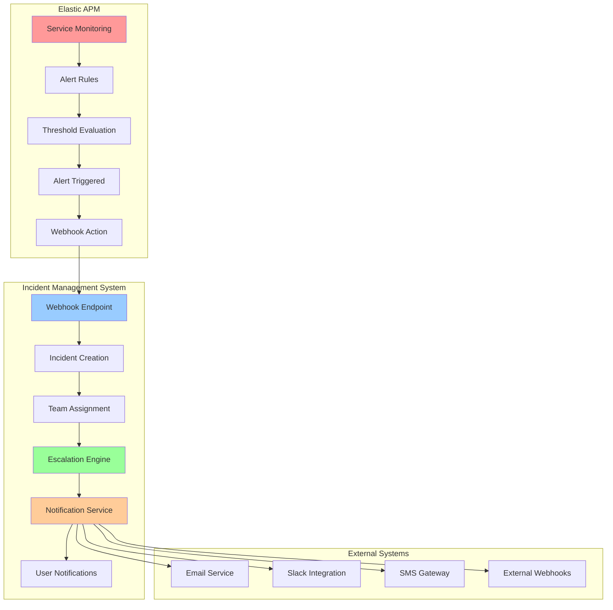
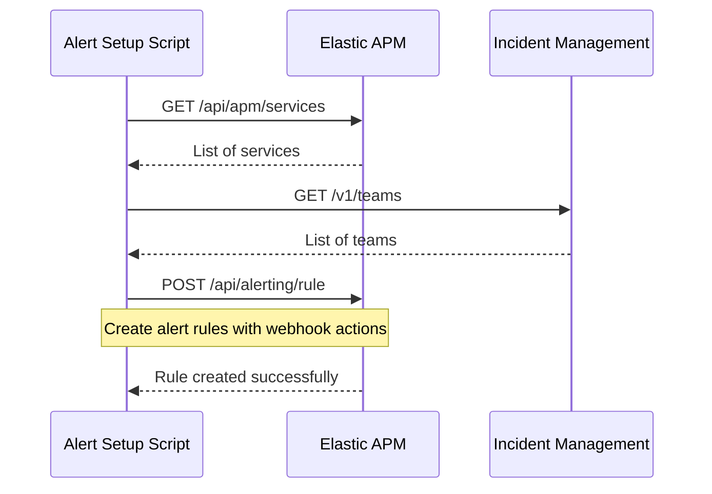
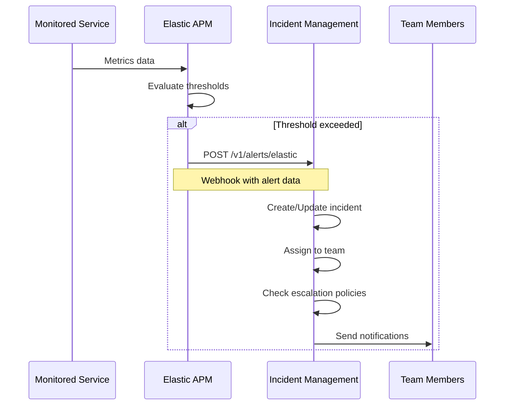
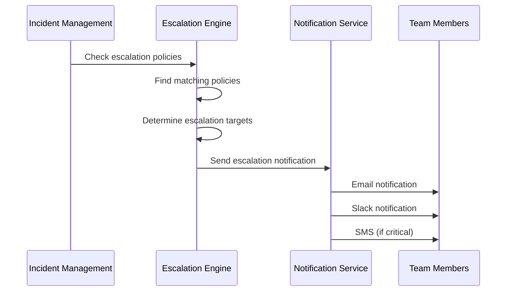
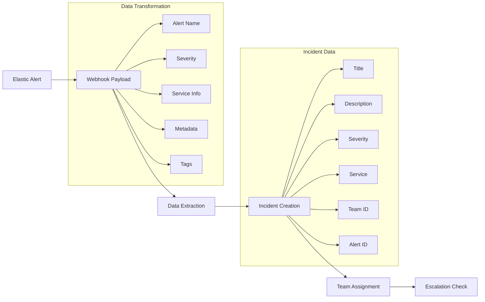
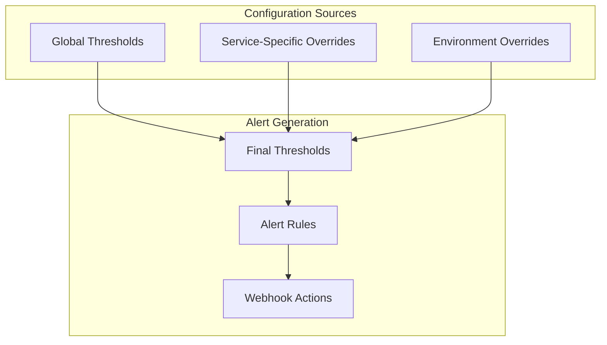
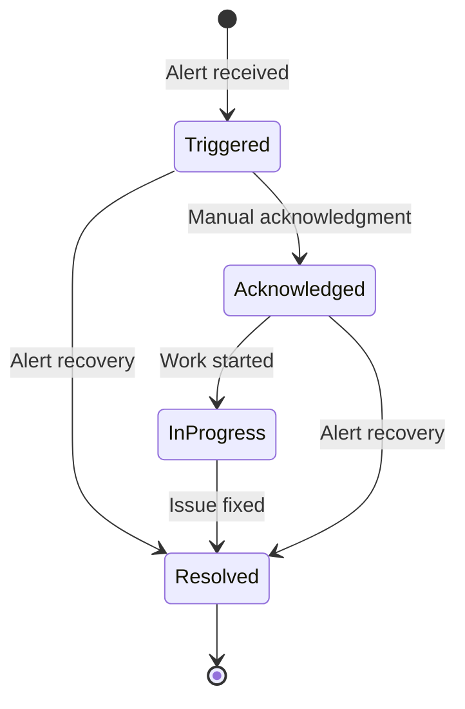
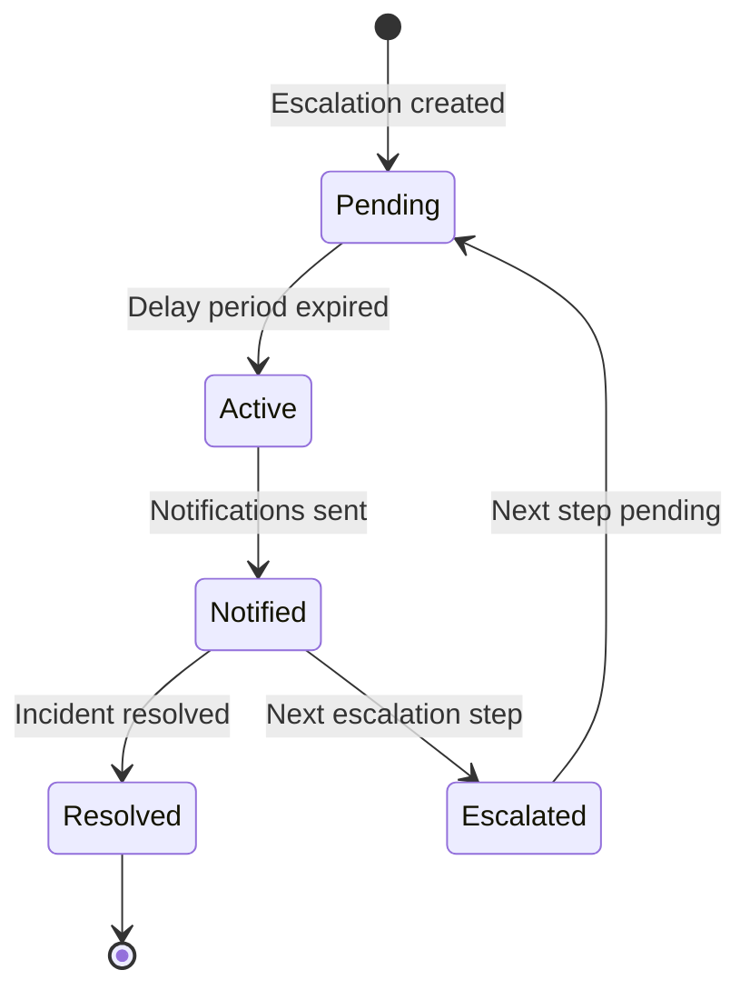
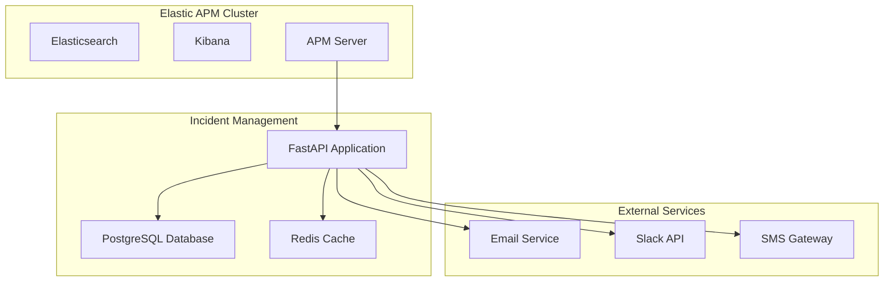

# Elastic APM - Incident Management Integration Architecture

## 🏗️ **System Architecture Overview**

## 🔗 **Integration Points**

### **1. Alert Rule Creation**

### **2. Alert Triggering and Incident Creation**

### **3. Escalation and Notification Flow**

## 📊 **Data Flow Architecture**

### **Alert Data Transformation**

### **Configuration Hierarchy**

## 🔧 **Key Components**

### **1. Elastic APM Alert Manager**
- **Service Discovery**: Queries Elastic APM for monitored services
- **Alert Rule Creation**: Creates alert rules with webhook actions
- **Team Mapping**: Maps services to incident management teams
- **Configuration Management**: Handles global and service-specific thresholds

### **2. Incident Management Webhook Handler**
- **Webhook Processing**: Receives and validates Elastic APM webhooks
- **Incident Creation**: Creates new incidents from alert data
- **Incident Updates**: Updates existing incidents with new alert information
- **Recovery Handling**: Automatically resolves incidents when alerts recover

### **3. Escalation Engine**
- **Policy Matching**: Matches incidents to escalation policies
- **Target Resolution**: Finds appropriate escalation targets
- **Timing Management**: Handles escalation delays and timeouts
- **Status Tracking**: Tracks escalation event status

### **4. Notification Service**
- **Multi-Channel Delivery**: Email, Slack, SMS, webhooks
- **User Preferences**: Respects user notification preferences
- **Template Management**: Handles notification templates
- **Delivery Tracking**: Tracks notification delivery status

## 🔄 **State Management**

### **Incident States**

### **Escalation States**

## 🔐 **Security and Authentication**

### **API Authentication**
- **Elastic APM**: API Key authentication for service discovery and alert creation
- **Incident Management**: Bearer token authentication for webhook endpoints
- **Team Mapping**: Secure configuration file with team assignments

### **Data Validation**
- **Webhook Payload**: Pydantic schema validation for all incoming webhooks
- **Configuration Files**: JSON schema validation for configuration files
- **User Permissions**: Role-based access control for incident management

## 📈 **Monitoring and Observability**

### **Integration Metrics**
- **Alert Creation Rate**: Number of alerts created per time period
- **Incident Creation Rate**: Number of incidents created from alerts
- **Escalation Rate**: Percentage of incidents that escalate
- **Resolution Time**: Time from incident creation to resolution
- **Webhook Success Rate**: Percentage of successful webhook deliveries

### **Error Handling**
- **Webhook Failures**: Retry logic for failed webhook deliveries
- **Configuration Errors**: Graceful handling of invalid configurations
- **Service Unavailability**: Fallback mechanisms for service outages
- **Data Validation Errors**: Detailed error logging for debugging

## 🚀 **Deployment Architecture**

### **Component Deployment**

### **Configuration Management**
- **Environment Variables**: Sensitive configuration (API keys, tokens)
- **Configuration Files**: Non-sensitive configuration (thresholds, team mapping)
- **Database**: Dynamic configuration (escalation policies, user preferences)
- **Secrets Management**: Secure storage for credentials and tokens

---

**This architecture provides a robust, scalable, and maintainable integration between Elastic APM and the incident management system, ensuring reliable alert-to-incident workflows with full observability and control.**
